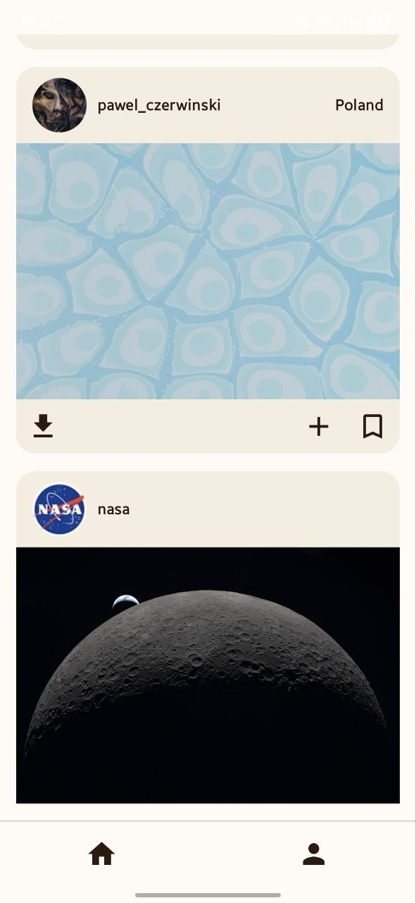
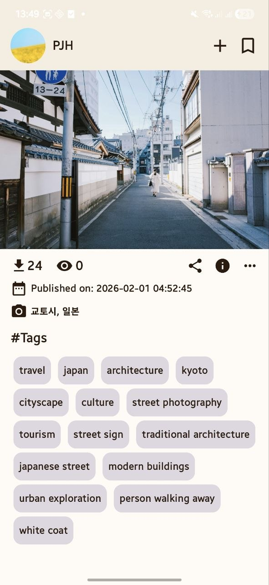
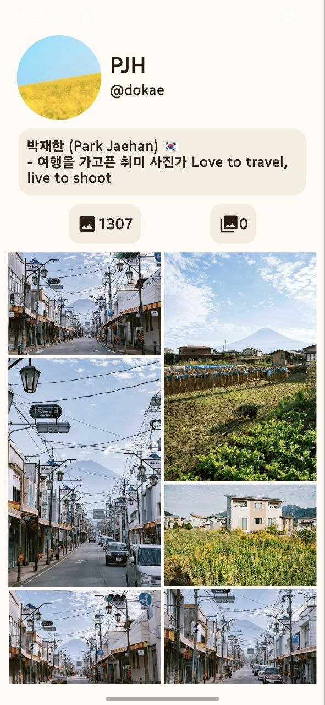
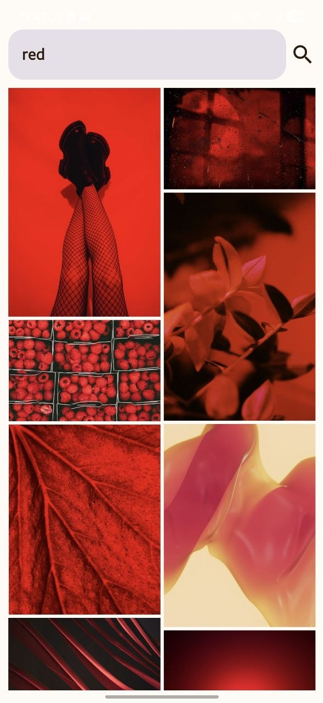

# AuraPhotos 📸

A photo browsing Android app powered by the [Unsplash API](https://unsplash.com/developers).

## Features

- **Photo Feed** — browse a curated feed of high-quality photography with pagination
- **Photo Details** — detailed view with metadata, tags, location, and download stats
- **Photographer Profiles** — explore profiles with their full photo collections and infinite scroll
- **Favorites** — save photos locally using Room database
- **OAuth 2.0 Authentication** — sign in with your Unsplash account
- **Share** — copy photo links to clipboard
## Tech Stack

| Category | Technology |
|---|---|
| Language | Kotlin |
| UI | Jetpack Compose |
| Architecture | Clean Architecture (data / domain / presentation) |
| DI | Hilt |
| Networking | Retrofit + kotlinx.serialization |
| Image Loading | Coil |
| Local Storage | Room + DataStore |
| Async | Coroutines + Flow |
| Navigation | Navigation Compose |
| Auth | OAuth 2.0 via Custom Tabs |

## Architecture

```
app/
├── data/
│   ├── dao/          # Room DAOs
│   ├── mapper/       # DTO → Domain mappers
│   ├── models/       # Room entities
│   └── network/
│       ├── model/    # API DTOs
│       ├── remote/   # Retrofit interfaces
│       └── repo/     # Repository implementations
├── di/               # Hilt modules
├── domain/
│   ├── models/       # Domain models
│   ├── repo/         # Repository interfaces
│   └── usecases/     # Use cases
└── presentation/
    ├── screens/      # Composable screens
    └── viewmodels/   # ViewModels
```

## Setup

1. Clone the repository
2. Get your API keys from [Unsplash Developers](https://unsplash.com/developers)
3. Add keys to `gradle.properties`:
```
UNSPLASH_KEY=your_access_key
SECRET_KEY=your_secret_key
```
4. Build and run

## Screenshots







## License

This project uses the [Unsplash API](https://unsplash.com/developers) under their [Terms of Service](https://unsplash.com/terms).
